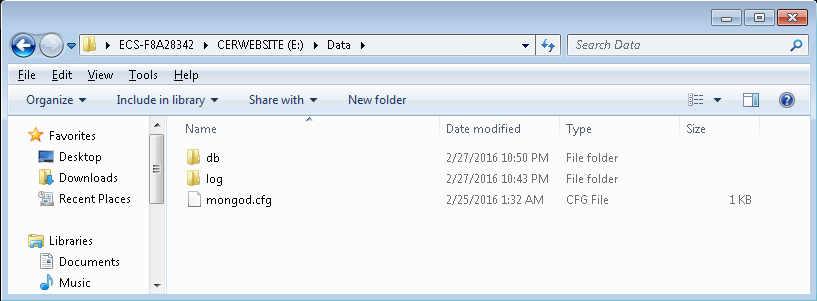

# The steps to install the CERREPORT website

1. Install git and get the source code from https://git.autodesk.com/chenju/CERREPORT
    - Suppose the code is cloned to e:\CERWebSite
   
2. Install nodejs and related packages
    - Install node-v4.2.6-x64.msi or later
    - Install the nodejs packages as below

        ```bash
        $ npm install -g supervisor
        $ npm install -g coffee-script
        $ cd e:\CERWebSite
        $ npm install
        $ cd WebSite
        $ npm install
        $ cd ..\WebService
        $ npm install
        ```
3. Install oracle instant client package
    - Unzip the file *\\\\shadskres1\Dataxfer\Jun Chen\ODAC1120320Xcopy_x64.zip* to e:
    - CD the unzipped folder and execute the cmd `install.bat odp.net e:\OracleClient ODAC`
    - Set Environment variable  **ORACLE_HOME**. Set ORACLE_HOME=e:\OracleClient
    - Update PATH environment variable. Append the `%ORACLE_HOME%` to the end of PATH variable
    
4. Install the mongodb database
    - Download the msi installer from https://www.mongodb.org. Suppose the downloaded name is mongodb-win32-x86_64-2008plus-ssl-3.2.4-signed.msi.
    - Install mongodb to c:\mongodb as below:

        ```bash
        msiexec.exe /q /i mongodb-win32-x86_64-2008plus-ssl-3.2.4-signed.msi ^
                    INSTALLLOCATION="C:\mongodb" ^
                    ADDLOCAL="all"
        ```
    - Copy the old DB files to e:\Data. The file structure is just as below.
        
        The content of the file mongod.cfg

        ```
        systemLog:
            destination: file
            path: e:\Data\log\mongod.log
        storage:
            dbPath: e:\Data\db
            mmapv1:
                nsSize: 32
        ```
    - Install the MongoDB service

        ```bash
        $ "C:\mongodb\bin\mongod.exe" --config "e:\Data\mongod.cfg" --install
        $ net start MongoDB
        ```
5. Launch the service
  
    ```bash
    $ cd e:\CERWebSite
    $ cd WebService
    $ npm start
    $ cd ..\WebSite
    $ npm start
    ```

## Note

The CERReport website need access the CERPRD-DB. If you cannot access the database from the computer you installed, you need send AR to get the permissions. The destination is ussclpecergp-scan.autodesk.com, the port is 1521.

And the website also need to access the http://certools.autodesk.com. You need send AR if the access is blocked.
