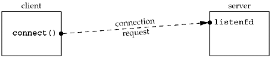
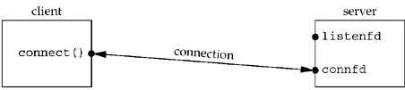
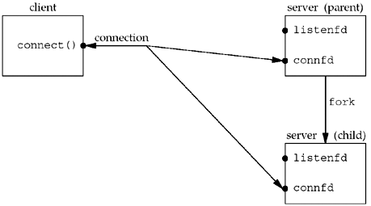
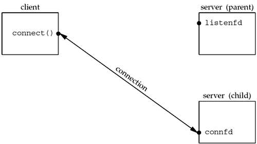

##阅读笔记

###4.8 并发服务器
Unix下写一个并发服务器程序的最简单的办法就是为每个客户均fork一个子进程。

```c
pid_t pid;
int listenfd = socket(...);
bind(listenfd,...);
listen(listenfd, LISTENQ);

for(;;) {
	int connfd = accept(listenfd,...);  // probably blocks
	if ( (pid = fork()) == 0) {
		close(listenfd);   // child closes listening socket
		doit(connfd);      // process the request
		close(connfd);     // done with this client 
		exit(0);           // child terminates
	}

	close(connfd);         // parent closes connected sockets
} 	
```



accept返回前client/server状态



accept返回后client/server状态



fork返回后client/server状态



父子进程关闭相应socket后client/server状态

###5.7 正常终止

1. When we type our EOF character, fgets returns a null pointer and the function str_cli returns.

2. When str_cli returns to the client main function, the latter terminates by calling exit.

3. Part of process termination is the closing of all open descriptors, so the client socket is closed by the kernel. This sends a FIN to the server, to which the server TCP responds with an ACK. This is the first half of the TCP connection termination sequence. At this point, the server socket is in the CLOSE_WAIT state and the client socket is in the FIN_WAIT_2 state.

4. When the server TCP receives the FIN, the server child is blocked in a call to readline, and readline then returns 0. This causes the str_echo function to return to the server child main.

5. The server child terminates by calling exit.

6. All open descriptors in the server child are closed. The closing of the connected socket by the child causes the final two segments of the TCP connection termination to take place: a FIN from the server to the client, and an ACK from the client. At this point, the connection is completely terminated. The client socket enters the TIME_WAIT state.

7. Finally, **the SIGCHLD signal is sent to the parent when the server child terminates**. This occurs in this example, but we do not catch the signal in our code, and the default action of the signal is to be ignored. Thus, the child enters the zombie state. We can verify this with the ps command.

###5.9 处理SIGCHLD信号
在我们的信号处理程序中(图5.7)，总是有一个显示的return语句，即使到了函数结尾也不例外，而信号处理程序并没有返回值。这么做有助于产生这样的警告：信号处理程序的return语句可能中断了某个系统调用。

当一个进程阻塞于慢系统调用时捕获到一个信号，等到信号处理程序返回时，系统调用可能返回一个EINTER错误。

###5.10 wait和waitpid函数
- 当派生子进程时，必须捕获信号SIGCHLD。
- 当捕获信号时，必须处理被中断的系统调用。
- SIGCHLD的信号处理必须正确编写，应使用函数waitpid以免留下僵尸进程。

###5.15 Crashing and Rebooting of Server Host

If it is important for our client to detect the crashing of the server host, even if the client is not actively sending data, then some other technique (such as the SO_KEEPALIVE socket option or some client/server heartbeat function) is required.

### Data Format
- Passing Text Strings between Client and Server
- Passing Binary Structures between Client and Server
